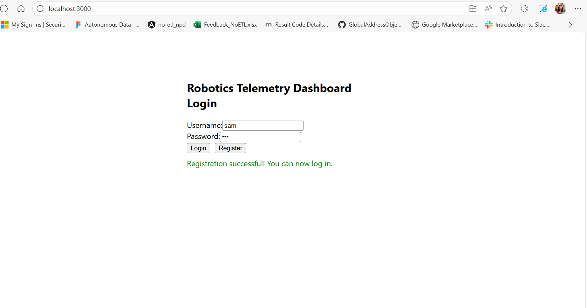

# Robotics Telemetry Dashboard (MERN + AWS Cloud)

## Overview

A scalable, secure, and real-time web dashboard for monitoring a fleet of autonomous mobile robots (AMRs). Built with the MERN stack and designed for AWS cloud deployment.

---

## Setup & Run Instructions

### Prerequisites
- Node.js (v16+)
- npm
- MongoDB (local, Docker/Podman, or AWS DocumentDB/Atlas)
- (Optional) Docker/Podman for local MongoDB

### Local Development

**1. Start MongoDB (if not using AWS):**
- Local: `mongod`
- Docker: `docker run -d --name robotics-mongo -p 27017:27017 -v mongodb_data:/data/db mongo:latest`
- Podman: `podman run -d --name robotics-mongo -p 27017:27017 -v mongodb_data:/data/db mongo:latest`

**2. Backend**
```sh
cd RoboticsTelemetryDashboardAssignment/server
npm install
node index.js
```
- The backend runs on `http://localhost:5000`

**3. Frontend**
```sh
cd RoboticsTelemetryDashboardAssignment/client
npm install
npm start
```
- The frontend runs on `http://localhost:3000`

---

## High-Frequency Data Sink Design (Kinesis/DynamoDB/TimeStream)

For ingesting and storing high-volume, continuous streams of raw sensor data (e.g., IMU readings, camera metadata) from 100+ robots, use **AWS Kinesis Data Streams** as a high-frequency data sink before the data reaches the main MongoDB database.

**Why Kinesis?**
- Scalable, real-time ingestion for thousands of records/sec.
- Buffers and reliably delivers data to downstream consumers.
- Integrates with AWS Lambda, Firehose, S3, DynamoDB, and DocumentDB.

**Architecture:**
1. Robots send raw telemetry to a Kinesis Data Stream.
2. Kinesis buffers and streams data.
3. AWS Lambda/Firehose processes and delivers data to:
   - MongoDB/DocumentDB (for dashboard queries)
   - S3/TimeStream (for analytics, time-series storage)
4. MongoDB stores only processed/aggregated data, reducing load.

**Justification:**  
Kinesis is purpose-built for high-throughput streaming, making it ideal for IoT/telemetry pipelines. DynamoDB is best for key-value lookups, and TimeStream is for time-series analytics after initial ingestion.

---

## Cloud Deployment Steps

### Frontend: Deploy React App to AWS S3 + CloudFront

1. **Build the React app:**
   ```sh
   cd client
   npm run build
   ```
2. **Upload the `build/` folder to an S3 bucket.**
3. **Enable static website hosting on the S3 bucket.**
4. **(Recommended) Set up CloudFront:**
   - Create a CloudFront distribution with the S3 bucket as the origin.
   - Enable caching, HTTPS, and custom domain if needed.
5. **Set S3 bucket policy for public read (or use CloudFront OAI for private).**

### Backend: Deploy Node.js/Express to AWS EC2 or Elastic Beanstalk

**Option 1: EC2**
- Launch an EC2 instance (Amazon Linux/Ubuntu).
- SSH into the instance, install Node.js and MongoDB client.
- Clone your repo, set environment variables (`MONGO_URI`, `JWT_SECRET`), and run:
  ```sh
  npm install
  node index.js
  ```
- Set up a process manager (PM2) and security group for port 5000.

**Option 2: Elastic Beanstalk**
- Install AWS CLI and EB CLI.
- From the `server` directory:
  ```sh
  eb init
  eb create robotics-dashboard-env
  ```
- Set environment variables in the EB console.
- Elastic Beanstalk handles scaling, health checks, and deployment.

---

## Authentication Strategy (JWT)

- **Registration:** Users register with a username and password (hashed with bcrypt).
- **Login:** Users log in and receive a JWT.
- **JWT Usage:** The JWT is sent in the `Authorization` header for all REST and WebSocket requests.
- **Backend:** Verifies JWT for all protected endpoints and WebSocket connections.
- **Frontend:** Stores JWT in localStorage and attaches it to all API/WebSocket requests.
- **Security:** JWT expires after 2 hours; 401 errors log the user out.

---

## Project Structure

```
RoboticsTelemetryDashboardAssignment/
  ├── client/   # React frontend
  └── server/   # Node.js/Express backend
```

---

## Contact

For questions or deployment help, contact the project maintainer.

---

## Screenshots

### Register Page


### Login Error


### Dashboard


### Edit/Config Page

